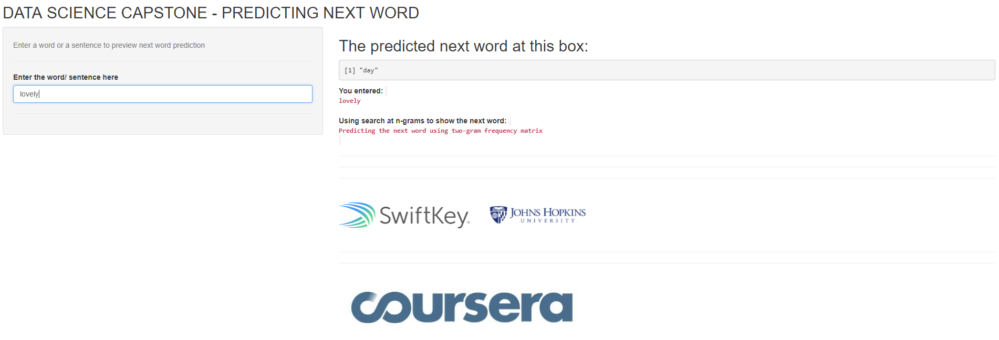

Next Word Prediction
========================================================
author: Hoang Viet Tran
date: December 26, 2017
autosize: true

* This is an application to predict a next word using n-grams technique from Natural Language Processing

* Here is the link to the application: [next word prediction](https://hoangtv1989.shinyapps.io/next_word_prediction/)

* The Capstone project is made possible between Coursera, Johns Hopkins University, and the Swiftkey company

Overview
========================================================
* The objective of this project is to develop a Shiny app that can predict the next word, similarly to the [Swiftkey](https://swiftkey.com/en) mobile app.

* Main tasks of this project are:
  1. Understanding the problem, getting and cleaning the data
  2. Making of Exploratory Data Analysis
  3. Tokeninzation of words and predictive text mining
  4. Writing a milestone project and a prediction model
  5. Developing a Shiny app and writing the presentation

* The data is from [HC Corpora](http://www.corpora.heliohost.org). Details are in the [final report](http://rpubs.com/hoangtv1989/344343)

Methods
========================================================
* After loaded the data, a sample was created, cleaned and prepared to be used as a corpus of text.

* The sample text was "tokenized" into so-called n-grams to construct the predictive models (Tokenization is the process of breaking a stream of text up into words, phrases. N-gram is a contiguous sequence of n items from a given sequence of text).

The Shiny application
========================================================
* The Shiny application allow the prediction of the next possible word in a sentence. 

* The user entered the text in an input box, and in the other one, the application returns the most probability word to be used.

Comments and links
========================================================
* Accuracy could be improved increasing the sample size. 

* The final report comes from the link [final Report](http://rpubs.com/hoangtv1989/344343). 

* The next word prediction app is hosted on shinyapps.io: [Shiny app](https://hoangtv1989.shinyapps.io/next_word_prediction/)

* The whole code of this application, as well as all the milestone report, related scripts, this presentation, etc. can be found in this GitHub repo: [GitHub](https://github.com/hoangtv1899/DataScienceCapstone)
